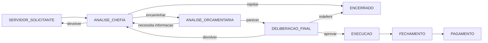
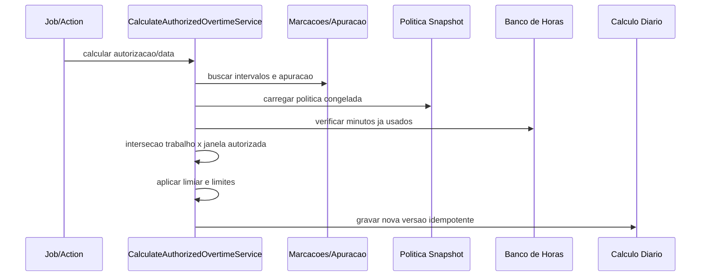

# Plano de Implementacao - Horas Extras / Servico Extraordinario

## 1. Analise tecnica inicial

O SECP esta organizado como uma aplicacao Next.js com App Router, Prisma 7 e modulos por dominio em `src/modules/<dominio>`, geralmente separados em `domain`, `application`, `infrastructure` e `presentation`. O acesso a dados usa o Prisma Client gerado em `src/generated/prisma`, com a instancia compartilhada em `src/shared/infrastructure/database/prisma.ts`.

O RBAC e dinamico, baseado em registros da tabela `permissoes` e associacao por `perfis_permissoes`. O codigo de permissao segue o formato `recurso:acao:escopo`, exposto na sessao ativa por `src/modules/auth/application/services/permissao.service.ts`. O controle server-side deve usar `exigirPermissao`, `exigirPermissaoOuRedirecionar` ou `exigirUmaDasPermissoesOuRedirecionar`, e toda tela/action deve validar permissao no servidor, nao apenas no menu.

O isolamento multi-tenant existente e feito por orgao e escopo do perfil ativo. O schema atual nao possui uma entidade generica `Tenant`; portanto, neste modulo `orgaoId` sera o identificador tenant. Consultas globais devem respeitar `orgaoIds` permitidos do perfil ativo, e consultas de escopo proprio devem derivar o servidor a partir de `usuarioId`.

Entidades que devem ser reutilizadas:

- `Servidor`, `Usuario`, `Perfil`, `Permissao`, `UsuarioPerfil`, `PerfilPermissao` para identidade e autorizacao.
- `Orgao` como tenant logico e `UnidadeOrganizacional`, `Lotacao`, `GestorUnidade` para escopo de unidade, chefia, substitutos e delegacoes.
- `Jornada`, `Escala`, `EscalaDia`, `JornadaServidor` para jornada regular e escala vigente.
- `MarcacaoBruta` como registro imutavel de origem, `Marcacao` como marcacao normalizada e `ApuracaoDiaria` como resultado de frequencia.
- `CalendarioInstitucional`, `RecessoForense`, `ConvocadoRecesso`, `EspelhoRecesso` e `AfastamentoSarh` para classificacao de dias e impedimentos.
- `BancoHorasSaldo`, `MovimentoBancoHoras` e `AutorizacaoBancoHoras` para impedir dupla utilizacao de minutos.
- `AuditoriaEvento` e `registrarAuditoriaEvento` para trilha de auditoria.
- `NotificacaoLeitura` e o agregador em `notificacoes.service.ts` para expor pendencias na experiencia do usuario.
- `shared/reporting` e `shared/export` para PDF/CSV, alem de XLSX a ser implementado por builder dedicado caso ainda nao exista utilitario comum.

O modulo novo nao deve reutilizar `Solicitacao` como tabela principal, porque servico extraordinario exige workflow versionado, parecer orcamentario, decisao formal, autorizacao imutavel, calculo diario, lote financeiro e snapshots. A tabela `Solicitacao` atual continua atendendo demandas de frequencia e banco de horas.

## 2. Bounded context proposto

Estrutura-alvo:

```text
src/modules/horas-extras/
  domain/
  application/
    actions/
    services/
    validators/
    workflows/
    calculations/
    reports/
    integrations/
  infrastructure/
    repositories/
  presentation/
    components/
```

O dominio deve separar explicitamente:

- jornada regular;
- credito/debito de banco de horas;
- excedente nao autorizado;
- minutos acima de limite;
- servico extraordinario autorizado para pagamento;
- servico extraordinario convertido em compensacao;
- recesso, plantao, sobreaviso e adicional noturno quando existirem parametros.

Regra estrutural: a mesma fracao de tempo nao pode compor simultaneamente lote de pecunia e movimento de banco de horas.

## 3. Modelo de dados incremental

A migracao inicial deve criar tabelas novas, sem alterar destrutivamente tabelas existentes. As relacoes devem usar `onDelete: Restrict` para entidades historicas e `SetNull` apenas em referencias opcionais de auditoria.

### Configuracao

- `OvertimeWorkflowDefinition`
- `OvertimeWorkflowVersion`
- `OvertimeWorkflowStepDefinition`
- `OvertimeWorkflowTransition`
- `OvertimeWorkflowAssigneeRule`
- `OvertimeResponsibilityAssignment`
- `OvertimePolicy`
- `OvertimePolicyVersion`
- `OvertimeRateRule`
- `OvertimeEligibilityRule`
- `OvertimeRubricRule`
- `OvertimeRubricMapping`

Todas as tabelas de configuracao devem ter `orgaoId`, vigencia (`validFrom`, `validUntil` quando aplicavel), `active`, `createdAt`, `updatedAt` e indices por tenant/vigencia.

### Solicitacao e workflow

- `OvertimeRequest`
- `OvertimeRequestDay`
- `OvertimeRequestAttachment`
- `OvertimeRequestHistory`
- `OvertimeWorkPlan`
- `OvertimeWorkflowInstance`
- `OvertimeWorkflowStepInstance`
- `OvertimeWorkflowAction`
- `OvertimeBudgetReview`
- `OvertimeBudgetAllocation`
- `OvertimeBudgetHistory`
- `OvertimeFinalDecision`
- `OvertimeAuthorization`
- `OvertimeAuthorizationDay`

`OvertimeRequest` deve manter situacao geral separada de etapa corrente do workflow, parecer orcamentario, decisao final, execucao e pagamento.

### Execucao, calculo e folha

- `OvertimeDailyCalculation`
- `OvertimeCalculationSegment`
- `OvertimeCalculationIssue`
- `OvertimeCalculationVersion`
- `EmployeeCompensationSnapshot`
- `EmployeeCompensationItem`
- `OvertimePayrollBatch`
- `OvertimePayrollBatchEmployee`
- `OvertimePayrollBatchLine`
- `OvertimePayrollAdjustment`

Campos de tempo devem ser inteiros em minutos. Campos financeiros devem ser `Decimal`, nunca `Float` ou `number` para persistencia/calculo monetario.

## 4. Enums iniciais

Os nomes abaixo devem ser criados como enums Prisma apenas para estados estruturais. Percentuais, rubricas e regras normativas devem ser dados configuraveis.

- `OvertimeRequestLifecycleStatus`: `DRAFT`, `SUBMITTED`, `IN_WORKFLOW`, `APPROVED`, `PARTIALLY_APPROVED`, `REJECTED`, `RETURNED`, `CANCELLED`, `CLOSED`.
- `OvertimePaymentDestination`: `PECUNIA`, `BANCO_DE_HORAS`, `A_DEFINIR`.
- `OvertimeBudgetReviewResult`: `AVAILABLE`, `PARTIALLY_AVAILABLE`, `UNAVAILABLE`, `NEEDS_INFORMATION`, `CANCELLED`.
- `OvertimeFinalDecisionResult`: `APPROVED`, `PARTIALLY_APPROVED`, `REJECTED`, `RETURNED`, `CANCELLED`.
- `OvertimeAuthorizationStatus`: `ACTIVE`, `SUPERSEDED`, `CANCELLED`, `EXPIRED`, `CLOSED`.
- `OvertimeCalculationStatus`: estados automaticos e de excecao definidos no requisito.
- `OvertimePayrollBatchStatus`: `DRAFT`, `CALCULATING`, `PENDING_REVIEW`, `READY_TO_CLOSE`, `CLOSED`, `EXPORTED`, `SENT_TO_PAYROLL`, `PAID`, `CANCELLED`.
- `OvertimeDayType`: `DIA_UTIL`, `SABADO`, `DOMINGO`, `FERIADO_NACIONAL`, `FERIADO_ESTADUAL`, `FERIADO_MUNICIPAL`, `FERIADO_REGIMENTAL`, `PONTO_FACULTATIVO`, `RECESSO`, `FOLGA_DE_ESCALA`.

## 5. Workflow configuravel

Template seed inicial: `FLUXO_HE_CHEFIA_ORCAMENTO_DELIBERACAO`.

Fluxo:



O motor nao deve converter nome de setor em status. Responsaveis devem ser resolvidos por `OvertimeResponsibilityAssignment` e `OvertimeWorkflowAssigneeRule`, usando perfil, usuario, unidade, fila funcional ou autoridade final.

## 6. Politica inicial

Seed de referencia para Justica Federal, editavel:

- 50% para dias uteis e sabados.
- 100% para domingos e feriados.
- limite diario de 120 minutos em dias uteis.
- limite mensal de 2640 minutos.
- limite anual de 8040 minutos.
- autorizacao previa obrigatoria.
- analise orcamentaria obrigatoria.
- inicio remuneravel configuravel apos a oitava hora em dia util.

Esses valores devem ficar em `OvertimePolicyVersion` e `OvertimeRateRule`, associados a fundamento normativo e vigencia.

## 7. Servicos de aplicacao

Servicos iniciais:

- `CreateOvertimeRequestService`
- `SubmitOvertimeRequestService`
- `ResolveOvertimeWorkflowAssigneesService`
- `RegisterOvertimeBudgetReviewService`
- `RegisterOvertimeFinalDecisionService`
- `CreateOvertimeAuthorizationService`
- `CalculateAuthorizedOvertimeService`
- `GenerateOvertimePayrollBatchService`
- `CloseOvertimePayrollBatchService`
- `ExportOvertimePayrollBatchService`

Porta SARH:

```typescript
export interface EmployeeCompensationProvider {
  getMonthlyCompensationSnapshot(input: {
    orgaoId: string;
    employeeId: string;
    competence: string;
  }): Promise<EmployeeCompensationSnapshot>;
}
```

Enquanto o contrato real do SARH nao existir, deve haver adaptador interno/mock sem Oracle, sem rubricas inventadas e sem payload externo ficticio.

## 8. Regras de calculo

Sequencia:



Regras:

- realizado menor que aprovado: paga apenas realizado;
- realizado maior que aprovado: paga ate o limite aprovado;
- marcacao incompleta: `PENDING_MARK_CORRECTION`;
- conflito com banco de horas: `OVERLAPPING_COMPENSATION`;
- calculo regular dentro da autorizacao: `AUTOMATICALLY_VALIDATED`, sem nova aprovacao da chefia;
- lote fechado nunca e alterado automaticamente; gerar ajuste complementar ou estorno.

## 9. Rotas e telas

Servidor:

- `/horas-extras`
- `/horas-extras/nova`
- `/horas-extras/[id]`
- `/horas-extras/[id]/editar`
- `/minhas-autorizacoes`

Chefia:

- `/gestao/horas-extras`
- `/gestao/horas-extras/[id]`

Orcamento:

- `/orcamento/horas-extras`
- `/orcamento/horas-extras/[id]`

Autoridade:

- `/deliberacao/horas-extras`
- `/deliberacao/horas-extras/[id]`

Folha:

- `/folha/horas-extras`
- `/folha/horas-extras/lotes`
- `/folha/horas-extras/lotes/[id]`

Administracao:

- `/admin/horas-extras/politicas`
- `/admin/horas-extras/workflows`
- `/admin/horas-extras/responsaveis`
- `/admin/horas-extras/rubricas`
- `/admin/horas-extras/parametros`

## 10. Permissoes

Permissoes no padrao SECP:

- `horas-extras:visualizar:proprio`
- `horas-extras:solicitar:proprio`
- `horas-extras:cancelar:proprio`
- `horas-extras:solicitar:unidade`
- `horas-extras:analisar:chefia`
- `horas-extras:devolver:global`
- `horas-extras:rejeitar:global`
- `horas-extras:encaminhar-orcamento:chefia`
- `horas-extras:responder-orcamento:global`
- `horas-extras:deliberar:global`
- `horas-extras:aprovar-parcial:global`
- `horas-extras:cancelar-autorizacao:global`
- `horas-extras:visualizar-execucao:global`
- `horas-extras:analisar-excecao:global`
- `horas-extras:reprocessar:global`
- `horas-extras:configurar-politica:global`
- `horas-extras:configurar-workflow:global`
- `horas-extras:configurar-responsaveis:global`
- `horas-extras:visualizar-folha:global`
- `horas-extras:gerar-lote:global`
- `horas-extras:fechar-lote:global`
- `horas-extras:exportar:global`
- `horas-extras:auditar:global`

Vinculos iniciais sugeridos:

- `SERVIDOR`: visualizar, solicitar e cancelar propria.
- `CHEFIA`: analisar chefia, devolver, rejeitar e encaminhar orcamento.
- `SECAP`: visualizar execucao, analisar excecao, configurar parametros funcionais quando autorizado.
- `SECAD` ou perfil institucional equivalente: deliberar e aprovar parcial se configurado como autoridade/responsavel.
- perfil de pagamento a ser criado ou associado: visualizar folha, gerar lote, fechar lote e exportar.
- `MASTER` e `ADMIN`: todas.

## 11. Validacoes obrigatorias

As validacoes devem ficar em Zod e servicos de dominio, sempre repetidas no servidor:

- periodo invalido;
- data fora do periodo;
- data duplicada;
- minutos zero/negativos;
- horario final anterior ao inicial;
- sobreposicao de janelas;
- antecedencia insuficiente;
- servidor afastado ou em ferias;
- servidor fora da unidade/tenant;
- limite diario, mensal e anual;
- conflito com outra autorizacao;
- conflito com banco de horas;
- parecer orcamentario ausente/vencido;
- valor acima do orcamento;
- autoridade/workflow/politica sem vigencia;
- rubrica nao mapeada;
- snapshot remuneratorio ausente;
- marcacao incompleta.

## 12. Auditoria e notificacoes

Cada transacao sensivel deve gravar `AuditoriaEvento` com usuario, entidade, acao, antes/depois e metadados contendo permissao utilizada, perfil ativo, orgao, unidade, IP, user-agent e correlationId quando disponivel.

Eventos de notificacao devem ser agregados no servico existente de notificacoes do usuario. Falha de notificacao nao pode abortar a transacao principal.

Eventos:

- `OVERTIME_REQUEST_SUBMITTED`
- `OVERTIME_REQUEST_RETURNED`
- `OVERTIME_REQUEST_REJECTED`
- `OVERTIME_BUDGET_REVIEW_REQUESTED`
- `OVERTIME_BUDGET_REVIEW_COMPLETED`
- `OVERTIME_FINAL_DECISION_REQUIRED`
- `OVERTIME_REQUEST_APPROVED`
- `OVERTIME_REQUEST_PARTIALLY_APPROVED`
- `OVERTIME_AUTHORIZATION_CANCELLED`
- `OVERTIME_EXECUTION_ISSUE`
- `OVERTIME_PAYROLL_BATCH_CLOSED`
- `OVERTIME_PAYMENT_PROCESSED`

## 13. Ordem de implementacao recomendada

1. Criar migracao Prisma com configuracao, workflow, politica, solicitacao e autorizacao.
2. Atualizar seed com permissoes, politica padrao e workflow `FLUXO_HE_CHEFIA_ORCAMENTO_DELIBERACAO`.
3. Criar repositorios e tipos de dominio.
4. Criar wizard de solicitacao com expansao de recorrencia e validacao do caso 01.
5. Criar caixa da chefia e acoes de devolver/rejeitar/encaminhar.
6. Criar parecer orcamentario e bloqueio de decisao acima do parecer.
7. Criar deliberacao final e autorizacoes imutaveis por data.
8. Criar calculo automatico autorizado, inicialmente usando `Marcacao` e `ApuracaoDiaria`.
9. Criar fila de excecoes e reprocessamento versionado.
10. Criar snapshot remuneratorio via porta SARH mock/interna.
11. Criar lote mensal, fechamento, hash e exportacoes.
12. Criar indicadores e relatorios.
13. Completar testes unitarios, integracao e E2E.

## 14. Riscos e decisoes

- O requisito usa `tenantId`, mas o schema atual usa `orgaoId`; decisao: usar `orgaoId` como tenant do modulo.
- A integracao remuneratoria SARH real nao esta definida; decisao: criar apenas porta e adaptador mock/interno, sem Oracle e sem rubricas inventadas.
- O modulo e grande demais para uma unica migracao segura; decisao: migrations incrementais por fatia funcional.
- A UI administrativa usa `/administracao` hoje, mas o requisito lista `/admin`; decisao: manter rotas exigidas como aliases ou redirecionamentos quando a administracao real for implementada.
- O botao atual de autorizacao de hora extra em apuracao pertence ao banco de horas; decisao: nao reaproveitar como autorizacao remuneratoria.

## 15. Criterios de pronto por fase

### Fase 1 - Fundacao

- Prisma gera sem erros.
- Seed cria permissoes, workflow e politica inicial.
- Menu mostra acesso ao servidor e aos perfis responsaveis.
- Testes unitarios validam recorrencia e limite diario do caso 01.

### Fase 2 - Tramitacao

- Servidor cria rascunho, valida e envia.
- Chefia devolve, rejeita ou encaminha.
- Orcamento emite parecer integral/parcial/desfavoravel.
- Autoridade aprova integral/parcial ou indefere.
- Auditoria registra todas as acoes.

### Fase 3 - Execucao

- Autorizacao gera dias objetivos.
- Calculo usa marcacoes, jornada, escala, afastamentos, calendario e politica congelada.
- Excecoes entram em fila propria.
- Nao ha dupla utilizacao com banco de horas.

### Fase 4 - Folha e relatorios

- SEPAG/unidade configurada gera lote mensal.
- Lote fechado e imutavel.
- Exportacoes PDF, XLSX e CSV disponiveis.
- Snapshot remuneratorio preserva reprodutibilidade.

