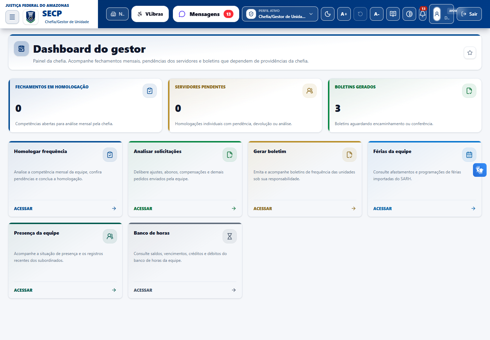
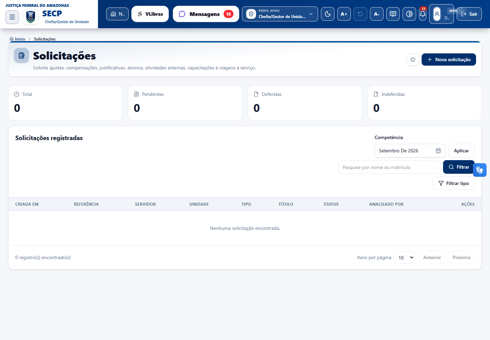
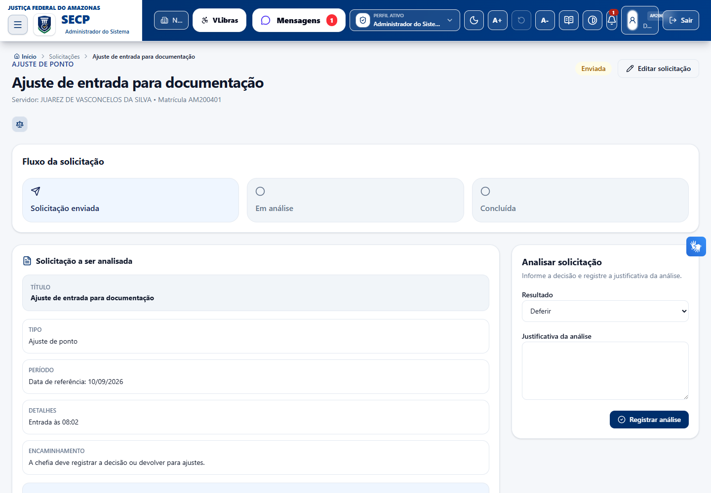
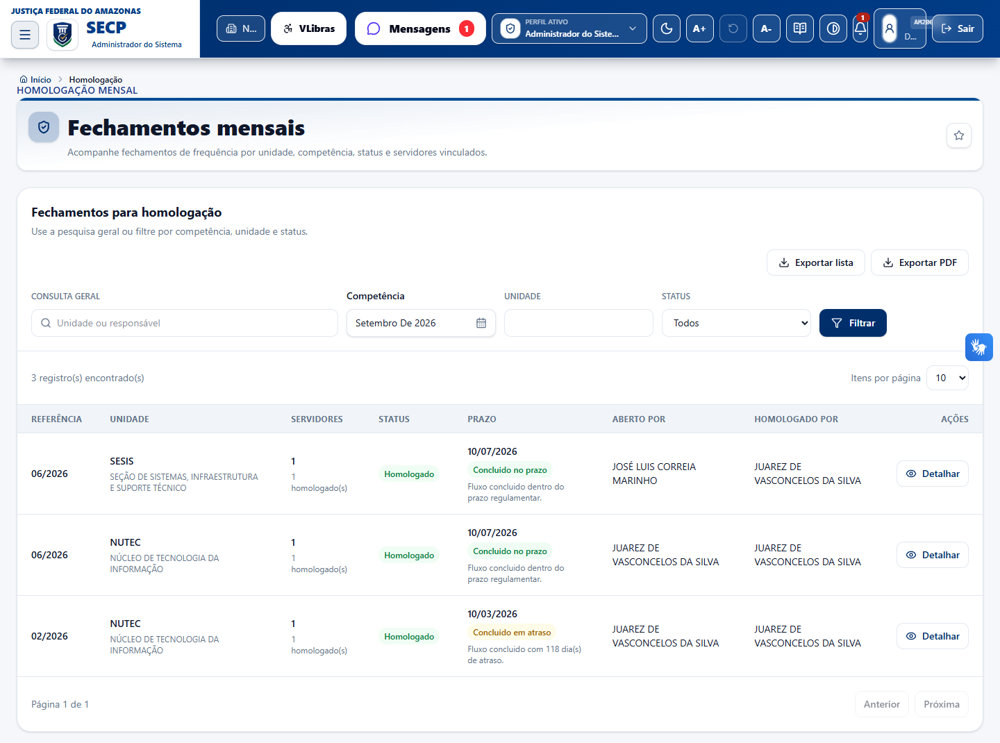

# Manual do gestor - Análise de solicitações de ajuste de ponto no SECP

Este manual orienta chefias, gestores e usuários com permissão de análise a avaliar solicitações de ponto criadas pelos servidores no SECP. O objetivo é explicar quando deferir, indeferir ou devolver para ajustes, quais conferências fazer antes da decisão e quais efeitos práticos cada decisão produz no espelho de ponto, banco de horas, apuração e auditoria.

## Onde acessar

1. Entre no SECP com perfil que possua permissão de análise.
2. Acesse **Solicitações**.
3. Use os filtros de competência, servidor ou tipo, quando necessário.
4. Clique em **Detalhar** na solicitação desejada.
5. Confira o quadro **Solicitação a ser analisada**.
6. No painel **Analisar solicitação**, selecione o resultado.
7. Informe a **Justificativa da análise**.
8. Clique em **Registrar análise**.

O formulário de análise aparece apenas quando a solicitação está em situação analisável e o usuário tem permissão para atuar como chefia responsável ou possui acesso global.

## Quem pode analisar

- Chefia responsável pelo servidor ou pela unidade vinculada à solicitação.
- Gestor titular, substituto ou delegado de chefia, quando configurado para a unidade.
- Usuário com permissão global de consulta/análise, conforme perfil ativo.

Permissões envolvidas:

- `solicitacoes:analisar:chefia`
- `solicitacoes:consultar:global`

## Situações analisáveis

A solicitação pode ser analisada quando estiver com status:

- **Enviada**
- **Em análise**

Solicitações já **deferidas**, **indeferidas** ou **canceladas** não devem receber nova análise pelo fluxo comum.

## Decisões possíveis

### Deferir

Use quando o pedido está correto, possui fundamento suficiente e deve produzir efeito no ponto, na apuração ou no banco de horas.

Efeitos práticos:

- O status passa para **Deferida**.
- A chefia, data/hora da análise e justificativa ficam registradas.
- O sistema registra evento na linha do tempo da solicitação.
- O sistema registra auditoria da decisão.
- O procedimento de frequência correspondente é registrado.
- Quando o tipo altera apuração, marcações ou banco de horas, o SECP recalcula os dias/competências impactados.
- O espelho de ponto, marcações, apuração e banco de horas são revalidados para refletir a decisão.

Quando pode falhar:

- A competência impactada já está homologada e não foi reaberta.
- A solicitação não possui dados mínimos válidos para gerar o efeito.
- O usuário não tem permissão para autorizar o procedimento necessário.
- A regra de procedimento da seccional bloqueia a aplicação.

### Indeferir

Use quando o pedido não deve produzir efeito, por ausência de fundamento, inconsistência, pedido incompatível com a realidade apurada ou desacordo com a regra aplicável.

Efeitos práticos:

- O status passa para **Indeferida**.
- A justificativa da decisão fica registrada.
- O sistema registra evento na linha do tempo.
- O sistema registra auditoria.
- Não é criada marcação ajustada.
- Não é criada autorização de banco de horas.
- Não há aplicação de abono, dispensa, viagem, capacitação ou atividade externa.
- Não há recálculo automático por deferimento.

### Devolver para ajustes

Use quando o pedido pode ser corrigido pelo servidor antes da decisão final, por exemplo: data incorreta, hora incompleta, tipo de marcação errado, justificativa insuficiente ou período impreciso.

Efeitos práticos:

- A solicitação volta para status **Enviada**.
- A análise final ainda não fica concluída.
- O responsável pela análise e a data de análise final são limpos.
- A justificativa da devolução fica registrada.
- O sistema registra evento informando a devolução.
- Não é aplicado efeito no ponto nem no banco de horas.
- O servidor pode ajustar a solicitação, quando a tela permitir edição para o status atual.

## Como analisar com segurança

Antes de escolher o resultado:

1. Confira servidor, matrícula e unidade.
2. Confira tipo da solicitação.
3. Confira data de referência ou período.
4. Confira se o pedido corresponde ao fato narrado.
5. Confira se há conflito com marcações já existentes.
6. Confira se o período ainda pode receber alteração.
7. Avalie se a justificativa é suficiente para a decisão.
8. Quando houver banco de horas, confira saldo, débito, crédito e período.
9. Quando houver teletrabalho, capacitação ou atividade externa, confira se o efeito pretendido é compatível com a regra.
10. Registre justificativa clara, pois ela fica na trilha de auditoria.

## Como escrever a justificativa da análise

Use uma justificativa objetiva e vinculada ao pedido.

Exemplos para deferimento:

- `Deferido. Justificativa compatível com as informações apresentadas e período conferido no espelho de ponto.`
- `Deferido ajuste de entrada, pois a ausência da marcação foi comprovada e não há conflito com as demais marcações do dia.`
- `Deferida autorização prévia, limitada ao período e à quantidade solicitada.`

Exemplos para indeferimento:

- `Indeferido. O período informado não corresponde à ocorrência descrita.`
- `Indeferido. Há marcação válida no horário solicitado, sem necessidade de ajuste.`
- `Indeferido. Não há saldo/condição suficiente para a compensação solicitada.`

Exemplos para devolução:

- `Devolvido para ajustes. Informar a hora correta da marcação pretendida.`
- `Devolvido para ajustes. Corrigir o período solicitado e detalhar a justificativa.`
- `Devolvido para ajustes. Selecionar a modalidade correta da capacitação.`

## Tipos de solicitação e efeitos práticos

## 1. Ajuste de ponto

Use para corrigir marcação específica de entrada, saída para intervalo, retorno do intervalo ou saída.

O que conferir:

- Data do ajuste.
- Tipo de marcação solicitado.
- Hora solicitada.
- Marcações já existentes no dia.
- Jornada vigente do servidor.
- Se a competência está aberta para alteração.

Quando deferir:

- A marcação realmente não foi registrada ou precisa ser corrigida.
- A hora solicitada é compatível com a jornada e com as demais marcações.
- A justificativa é suficiente.

Efeito ao deferir:

- O SECP cria uma marcação administrativa com fonte **MANUAL_ADMINISTRATIVO**.
- A marcação fica com status **AJUSTADA**.
- A marcação recebe vínculo com a solicitação deferida.
- A apuração do dia e o espelho de ponto são recalculados.

Quando indeferir:

- Já existe marcação válida.
- A hora solicitada é incompatível com os registros.
- A justificativa não comprova a necessidade.

Quando devolver:

- O servidor escolheu tipo de marcação errado.
- A hora está incompleta ou aparenta erro.
- A justificativa precisa de esclarecimento.

## 2. Compensação

Use para autorizar compensação vinculada ao banco de horas.

O que conferir:

- Período informado.
- Modalidade da compensação.
- Débito a compensar ou crédito a utilizar.
- Compatibilidade com a regra da unidade.

Modalidades:

- **Utilizar crédito para compensar débito**: permite usar saldo positivo existente para abater débito.
- **Trabalhar horas para compensar débito**: autoriza compensação por trabalho em período autorizado.

Efeito ao deferir:

- O SECP registra autorização no banco de horas.
- A autorização fica vinculada à solicitação.
- O sistema calcula minutos autorizados conforme o período e os débitos encontrados, quando aplicável.
- A apuração e o banco de horas são recalculados.

Quando indeferir:

- Não existe débito a compensar no período.
- Não há crédito suficiente, quando a modalidade exige saldo.
- O período ou a modalidade não correspondem ao pedido.

Quando devolver:

- A modalidade escolhida está incorreta.
- O período está amplo ou impreciso.
- A justificativa não deixa claro qual débito ou crédito será tratado.

## 3. Abono/justificativa

Use para justificar ocorrência que impacta a frequência, sem tratar marcação específica.

O que conferir:

- Período solicitado.
- Motivo informado.
- Se a ocorrência justifica cobertura integral do dia.
- Se a regra da unidade permite o abono.

Efeito ao deferir:

- A solicitação passa a ser considerada na apuração.
- O período pode cobrir a jornada do dia.
- O crédito de banco de horas fica bloqueado para esse efeito, quando a regra classifica a ocorrência como abono/cobertura da jornada.
- O espelho é recalculado.

Quando indeferir:

- A justificativa não é suficiente.
- O fato narrado não gera abono.
- O período não corresponde à ocorrência.

Quando devolver:

- Falta detalhamento do motivo.
- A data inicial ou final está incorreta.

## 4. Atividade externa

Use quando o servidor trabalhou fora da unidade em atividade autorizada.

O que conferir:

- Data/hora inicial e final.
- Compatibilidade da atividade com a unidade.
- Se a atividade externa cobre todo o período informado ou apenas parte da jornada.

Efeito ao deferir:

- A apuração considera o período deferido como cobertura de trabalho externo.
- A cobertura pode ser parcial ou conforme o intervalo solicitado.
- O espelho de ponto é recalculado.

Quando indeferir:

- A atividade não foi autorizada.
- O período é incompatível.
- O pedido tenta cobrir ausência não relacionada à atividade externa.

Quando devolver:

- Falta informar melhor o período.
- A justificativa não identifica a atividade realizada.

## 5. Viagem a serviço

Use quando o servidor esteve em deslocamento ou missão institucional.

O que conferir:

- Data inicial e final.
- Se o período corresponde à viagem.
- Se a viagem é institucional e compatível com o pedido.

Efeito ao deferir:

- A apuração considera cobertura integral da jornada nos dias alcançados.
- Débitos/faltas do período coberto podem ser regularizados.
- Crédito de banco de horas fica bloqueado por esse efeito.
- O espelho é recalculado.

Quando indeferir:

- Não há relação com viagem a serviço.
- O período informado extrapola o período real.

Quando devolver:

- Datas precisam ser corrigidas.
- A justificativa não identifica o deslocamento ou missão.

## 6. Capacitação

Use quando o servidor participou de curso, treinamento ou evento de capacitação autorizado.

O que conferir:

- Data/hora inicial e final.
- Modalidade: externa ou interna.
- Duração da capacitação.
- Existência de registro biométrico, quando a capacitação for interna.

Efeito ao deferir:

- Capacitação externa com 4 horas ou mais pode cobrir a jornada integral.
- Capacitação externa inferior a 4 horas cobre apenas o período correspondente e pode exigir complementação da jornada.
- Capacitação interna exige marcações biométricas; sem comprovação biométrica, o período pode não ser abonado.
- O crédito de banco de horas é bloqueado para esse efeito.
- O espelho é recalculado.

Quando indeferir:

- A capacitação não foi autorizada.
- A modalidade está incompatível com a realidade.
- Não há registro exigido para capacitação interna.

Quando devolver:

- Modalidade errada.
- Horários ou período incompletos.
- Justificativa sem identificação do curso/evento.

## 7. Dispensa de ponto

Use para dispensa formal, teletrabalho integral ou regime híbrido.

O que conferir:

- Data/hora inicial e final.
- Regime informado: dispensa sem teletrabalho, teletrabalho integral ou híbrido.
- Dias remotos informados, quando o regime for híbrido.
- Se o período e o regime estão autorizados.

Efeito ao deferir:

- Dispensa comum registra frequência manual deferida, quando aplicável.
- Teletrabalho integral ou híbrido marca o dia como trabalho remoto conforme o regime.
- A cobertura pode regularizar a jornada do período deferido.
- Crédito de banco de horas fica bloqueado, salvo regra específica de serviço extraordinário remoto autorizado e comprovado.
- O espelho é recalculado.

Quando indeferir:

- Não há autorização de dispensa ou teletrabalho.
- O regime informado não corresponde ao ato autorizado.
- O dia remoto não está coberto pelo regime híbrido.

Quando devolver:

- Faltam dias remotos no regime híbrido.
- O servidor escolheu regime incorreto.
- O período precisa ser ajustado.

## 8. Autorização prévia de hora-crédito

Use para autorizar previamente horas adicionais que poderão gerar crédito no banco de horas.

O que conferir:

- Data/hora inicial e final.
- Quantidade de horas solicitadas.
- Necessidade do serviço.
- Limites regulamentares.
- Se o servidor efetivamente poderá registrar trabalho no período.

Efeito ao deferir:

- O SECP registra autorização do tipo **CREDITO** no banco de horas.
- A autorização fica vinculada à solicitação.
- O crédito efetivo depende da apuração das horas realmente trabalhadas.
- Em trabalho remoto/teletrabalho, o crédito extraordinário depende de autorização prévia e comprovação biométrica, conforme regra aplicada pelo SECP.
- O espelho e banco de horas são recalculados.

Quando indeferir:

- A necessidade do serviço não foi demonstrada.
- O pedido excede limite ou está fora da regra.
- O período não corresponde à demanda.

Quando devolver:

- Quantidade de horas incorreta.
- Período impreciso.
- Justificativa insuficiente.

## 9. Folga com banco de horas

Use para autorizar folga futura com uso de saldo de banco de horas.

O que conferir:

- Data inicial e final.
- Saldo disponível.
- Jornada vigente nos dias solicitados.
- Se os dias são úteis e geram apuração regular.

Efeito ao deferir:

- O SECP registra autorização de compensação com crédito do banco de horas.
- O sistema calcula a quantidade de minutos da folga conforme dias úteis e jornada vigente.
- A folga cobre a jornada quando não houver trabalho no dia.
- Se houver marcações trabalhadas no dia, a folga pode não ser aplicada na apuração daquele dia.
- O banco de horas e o espelho são recalculados.

Quando indeferir:

- Não há saldo suficiente.
- O período não corresponde a dia útil/jornada aplicável.
- A folga não foi acordada com a unidade.

Quando devolver:

- Período incorreto.
- Pedido não informa que usará banco de horas.
- Há dúvida sobre saldo ou datas pretendidas.

## Bloqueios e mensagens comuns

Competência homologada:

- O sistema pode impedir deferimento quando a solicitação altera espelho de ponto em competência já homologada.
- Nessa situação, a competência deve ser reaberta antes do deferimento.

Dados incompletos:

- Solicitações de banco de horas exigem período e quantidade/critério válidos.
- Ajuste de ponto exige data, tipo de marcação e hora.

Permissão insuficiente:

- O gestor precisa ter permissão de análise e autorização do procedimento correspondente.

Solicitação fora do escopo:

- Se a solicitação não pertence aos subordinados/unidades do gestor, o sistema bloqueia a análise.

## Depois da análise

Após registrar a decisão:

1. Confira a mensagem de sucesso ou erro.
2. Abra a solicitação novamente, se necessário, para confirmar status e linha do tempo.
3. Quando deferida, confira o espelho de ponto do servidor na competência impactada.
4. Para solicitações de banco de horas, confira também a autorização e o saldo.
5. Se o efeito não aparecer, verifique se houve bloqueio por homologação, ausência de jornada, período incorreto ou necessidade de recálculo.

## Boas práticas para gestores

- Prefira **devolver para ajustes** quando o pedido for corrigível.
- Prefira **indeferir** quando o pedido não deve produzir efeito.
- Prefira **deferir** apenas quando o efeito pretendido estiver claro e compatível com a regra.
- Não use deferimento para corrigir pedido de tipo errado; devolva para o servidor selecionar o tipo correto.
- Registre justificativa suficiente para auditoria.
- Após deferir, confira o espelho quando o ajuste tiver impacto relevante em crédito, débito, falta ou banco de horas.
