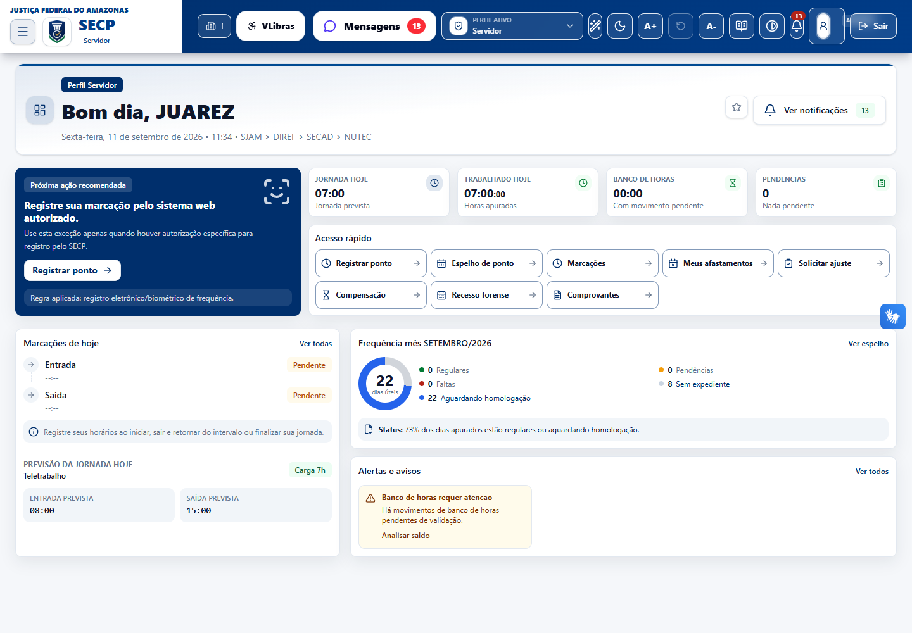
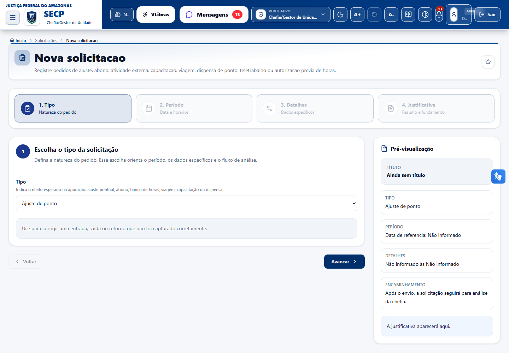
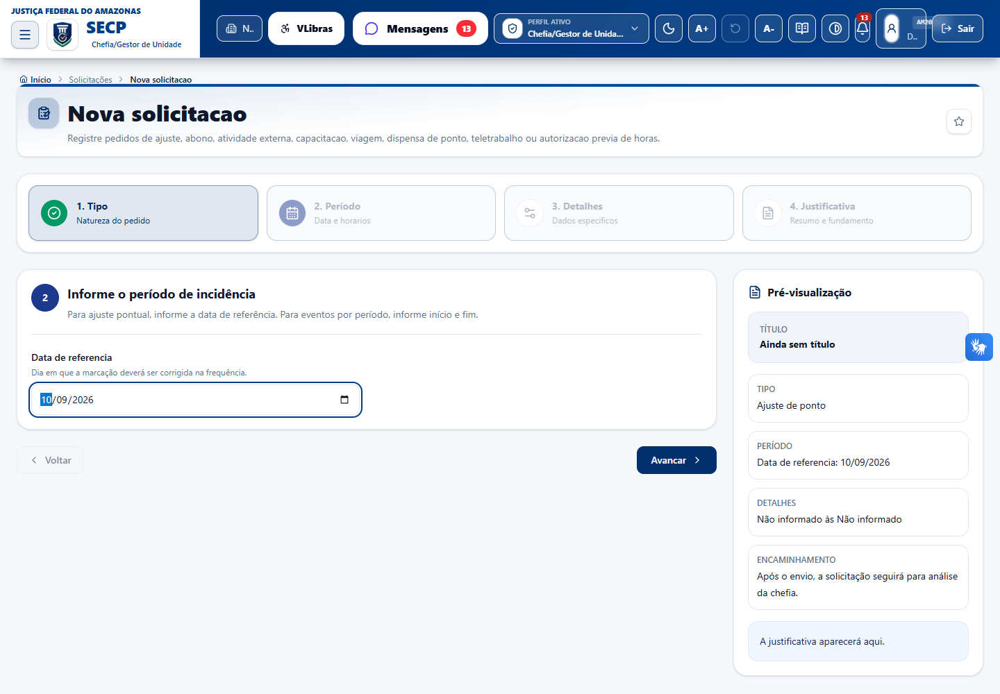
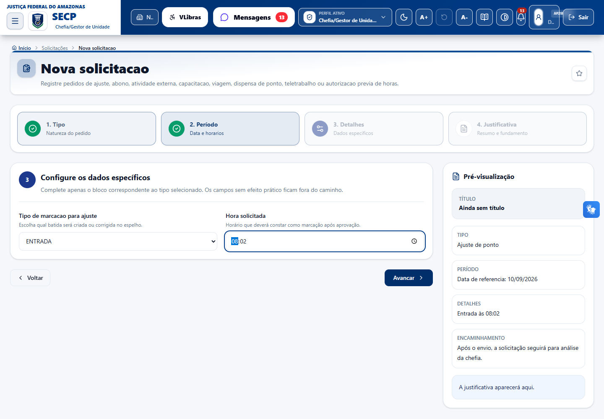
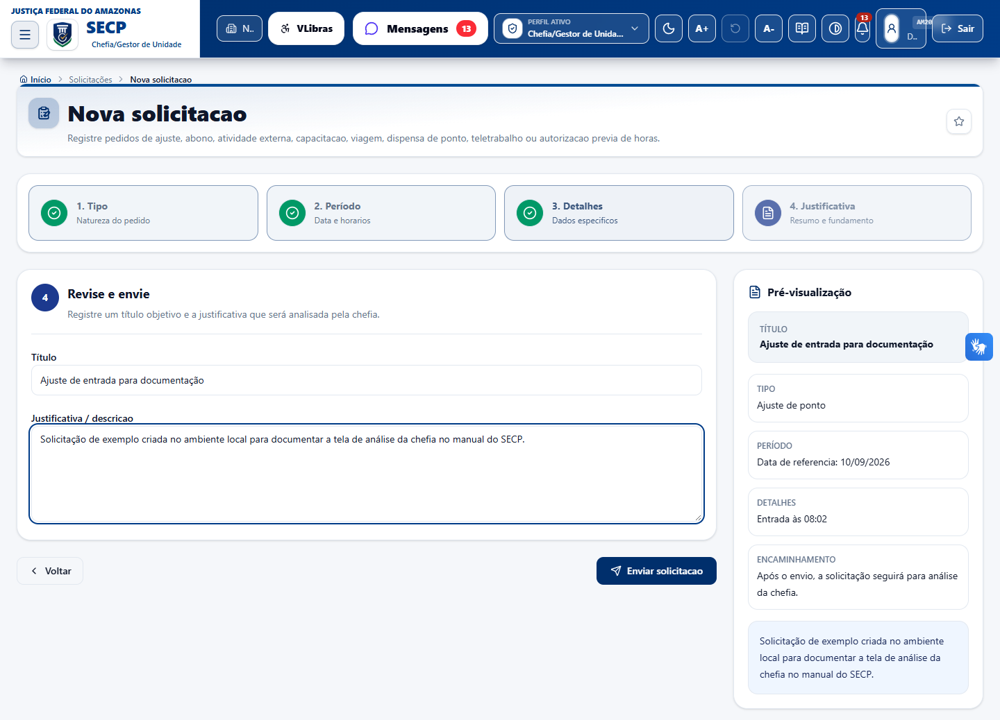
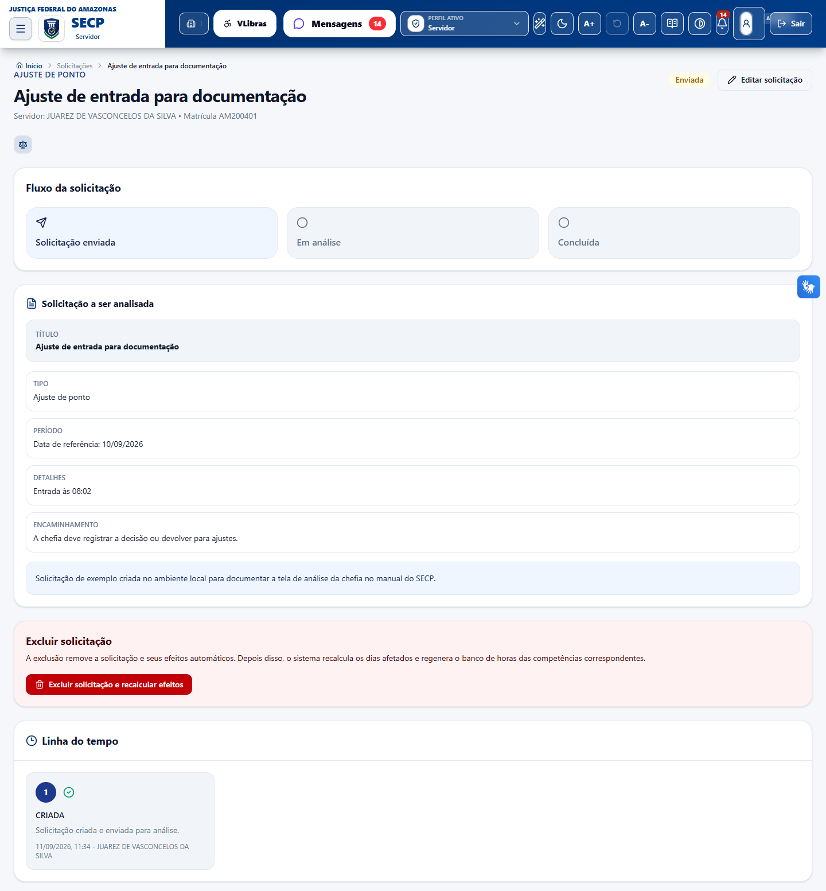

# Manual do servidor - Solicitações de ajuste de ponto no SECP

Este manual orienta o servidor a criar solicitações que impactam o ponto no SECP, incluindo ajuste de marcação, abono, compensação, atividade externa, viagem, capacitação, dispensa, hora-crédito prévia e folga com banco de horas.

## Onde acessar

1. Entre no SECP com seu usuário e senha.
2. Acesse o menu **Solicitações**.
3. Clique em **Nova solicitação**.
4. Preencha as quatro etapas da tela:
   - **Tipo**: escolha a natureza do pedido.
   - **Período**: informe a data ou o intervalo.
   - **Detalhes**: preencha os campos específicos do tipo escolhido.
   - **Justificativa**: informe título, descrição e envie a solicitação.

Após o envio, a solicitação é encaminhada para análise da chefia responsável. O andamento pode ser acompanhado em **Solicitações**.

## Antes de começar

- Confira se o pedido está dentro do prazo regulamentar da sua seccional.
- Confira se o período ainda não foi homologado ou enviado para etapa que bloqueie novos ajustes.
- Use títulos objetivos, por exemplo: `Ajuste de entrada em 05/09/2026`.
- Na justificativa, explique o fato de forma clara e direta: o que ocorreu, em qual dia/período e qual correção está sendo solicitada.
- Revise o resumo exibido na última etapa antes de clicar em **Enviar solicitação**.

## Fluxo geral de criação

1. Selecione o tipo de solicitação.
2. Clique em **Avançar**.
3. Informe a data ou período solicitado.
4. Clique em **Avançar**.
5. Preencha os detalhes específicos.
6. Clique em **Avançar**.
7. Informe o título e a justificativa.
8. Confira o resumo.
9. Clique em **Enviar solicitação**.

## Como escolher cada tipo de ajuste

- **Ajuste de ponto**: use quando faltou uma marcação específica ou quando uma marcação de entrada, saída, saída para intervalo ou retorno do intervalo precisa ser corrigida.
- **Compensação**: use quando precisar compensar débito de jornada ou utilizar crédito existente no banco de horas.
- **Abono/justificativa**: use quando houver uma ocorrência que precise ser justificada e analisada pela chefia, sem envolver marcação específica de entrada ou saída.
- **Atividade externa**: use quando o trabalho foi realizado fora da unidade, em atividade autorizada, e isso impactou o registro normal do ponto.
- **Viagem a serviço**: use quando esteve em deslocamento institucional ou missão oficial que impactou a frequência.
- **Capacitação**: use quando participou de curso, treinamento ou evento de capacitação autorizado.
- **Dispensa de ponto**: use quando houver dispensa formal, teletrabalho integral ou regime híbrido a registrar no período.
- **Autorização prévia de hora-crédito**: use antes da realização de horas adicionais que poderão gerar crédito no banco de horas.
- **Folga com banco de horas**: use para solicitar uma folga futura utilizando saldo do banco de horas.

## 1. Ajuste de ponto

Use quando uma entrada, saída, saída para intervalo ou retorno do intervalo não foi registrada corretamente.

### Passo a passo

1. Em **Tipo**, selecione **Ajuste de ponto**.
2. Em **Período**, informe a **Data do ajuste**.
3. Em **Detalhes**, selecione o **Tipo de marcação para ajuste**:
   - **Entrada**
   - **Saída para intervalo**
   - **Retorno do intervalo**
   - **Saída**
4. Informe a **Hora solicitada**.
5. Em **Justificativa**, informe um título objetivo.
6. Descreva o ocorrido e confirme qual marcação deve constar no espelho de ponto.
7. Confira o resumo e clique em **Enviar solicitação**.

### Exemplo

- **Título**: `Ajuste de entrada em 05/09/2026`
- **Justificativa**: `Solicito ajuste da entrada do dia 05/09/2026 para 08:02, pois a marcação não foi capturada no equipamento.`

## 2. Compensação

Use para solicitar compensação vinculada ao banco de horas.

### Passo a passo

1. Em **Tipo**, selecione **Compensação**.
2. Em **Período**, informe a **Data inicial** e a **Data final**.
3. Em **Detalhes**, escolha a **Modalidade da compensação**:
   - **Utilizar crédito para compensar débito**
   - **Trabalhar horas para compensar débito**
4. Em **Justificativa**, informe o motivo da compensação.
5. Confira o resumo e clique em **Enviar solicitação**.

### Exemplo

- **Título**: `Compensação de débito em setembro`
- **Justificativa**: `Solicito compensação do débito de jornada no período informado, conforme alinhado com a chefia.`

## 3. Abono/justificativa

Use para justificar ocorrência que impacta a frequência no período informado.

### Passo a passo

1. Em **Tipo**, selecione **Abono/justificativa**.
2. Em **Período**, informe a **Data inicial** e a **Data final**.
3. Em **Detalhes**, confira as informações exibidas. Esse tipo não exige campo adicional.
4. Em **Justificativa**, descreva o motivo do abono ou da justificativa.
5. Confira o resumo e clique em **Enviar solicitação**.

### Exemplo

- **Título**: `Justificativa de ausência`
- **Justificativa**: `Solicito análise da justificativa referente ao período informado, conforme ocorrência comunicada à chefia.`

## 4. Atividade externa

Use quando a jornada foi cumprida em atividade externa autorizada.

### Passo a passo

1. Em **Tipo**, selecione **Atividade externa**.
2. Em **Período**, informe a **Data/hora inicial** e a **Data/hora final** da atividade.
3. Em **Detalhes**, confira as informações exibidas. Esse tipo não exige campo adicional.
4. Em **Justificativa**, descreva a atividade realizada e o local, quando necessário.
5. Confira o resumo e clique em **Enviar solicitação**.

### Exemplo

- **Título**: `Atividade externa em 10/09/2026`
- **Justificativa**: `Solicito registro de atividade externa realizada no período informado, em serviço autorizado pela chefia.`

## 5. Viagem a serviço

Use quando houver viagem a serviço que impacte a frequência.

### Passo a passo

1. Em **Tipo**, selecione **Viagem a serviço**.
2. Em **Período**, informe a **Data inicial** e a **Data final** da viagem.
3. Em **Detalhes**, confira as informações exibidas. Esse tipo não exige campo adicional.
4. Em **Justificativa**, informe o motivo da viagem e o período correspondente.
5. Confira o resumo e clique em **Enviar solicitação**.

### Exemplo

- **Título**: `Viagem a serviço`
- **Justificativa**: `Solicito registro de viagem a serviço no período informado, conforme designação/autorização da unidade.`

## 6. Capacitação

Use para registrar capacitação autorizada que impacta a frequência.

### Passo a passo

1. Em **Tipo**, selecione **Capacitação**.
2. Em **Período**, informe a **Data/hora inicial** e a **Data/hora final**.
3. Em **Detalhes**, selecione a **Modalidade da capacitação**:
   - **Capacitação externa**
   - **Capacitação interna**
4. Em **Justificativa**, informe o curso, evento ou atividade de capacitação.
5. Confira o resumo e clique em **Enviar solicitação**.

### Atenção

- Capacitação interna exige registro biométrico no dia.
- Capacitação externa com carga igual ou superior a 4 horas pode cobrir a jornada, conforme regra aplicada pelo SECP.
- Capacitação externa com carga inferior a 4 horas pode exigir complementação da jornada.

### Exemplo

- **Título**: `Capacitação externa`
- **Justificativa**: `Solicito registro de capacitação externa realizada no período informado, autorizada pela chefia.`

## 7. Dispensa de ponto

Use para registrar dispensa de ponto, teletrabalho integral ou regime híbrido, conforme autorização aplicável.

### Passo a passo

1. Em **Tipo**, selecione **Dispensa de ponto**.
2. Em **Período**, informe a **Data/hora inicial** e a **Data/hora final**.
3. Em **Detalhes**, selecione o **Regime remoto**:
   - **Dispensa sem teletrabalho**
   - **Teletrabalho 100%**
   - **Regime híbrido**
4. Se escolher **Regime híbrido**, marque os dias remotos da semana.
5. Em **Justificativa**, descreva a autorização ou o motivo da dispensa.
6. Confira o resumo e clique em **Enviar solicitação**.

### Exemplo

- **Título**: `Dispensa de ponto`
- **Justificativa**: `Solicito registro de dispensa de ponto no período informado, conforme autorização da unidade.`

## 8. Autorização prévia de hora-crédito

Use para solicitar autorização prévia de horas que poderão gerar crédito no banco de horas.

### Passo a passo

1. Em **Tipo**, selecione **Autorização prévia de hora-crédito**.
2. Em **Período**, informe a **Data/hora inicial** e a **Data/hora final**.
3. Em **Detalhes**, informe a **Quantidade de horas** que depende de autorização.
4. Em **Justificativa**, explique a necessidade do trabalho extraordinário.
5. Confira o resumo e clique em **Enviar solicitação**.

### Atenção

- A quantidade deve ser maior que zero.
- A autorização não pode exceder 16 horas em uma solicitação.
- O crédito efetivo depende da apuração das horas realmente trabalhadas.

### Exemplo

- **Título**: `Autorização prévia de hora-crédito`
- **Justificativa**: `Solicito autorização prévia para realização de horas adicionais no período informado, em razão da demanda da unidade.`

## 9. Folga com banco de horas

Use para solicitar folga futura com base no saldo de banco de horas.

### Passo a passo

1. Em **Tipo**, selecione **Folga com banco de horas**.
2. Em **Período**, informe a **Data inicial** e a **Data final** da folga.
3. Em **Detalhes**, confira as informações exibidas. Esse tipo não exige campo adicional.
4. Em **Justificativa**, informe que a folga será compensada com saldo de banco de horas.
5. Confira o resumo e clique em **Enviar solicitação**.

### Exemplo

- **Título**: `Folga com banco de horas`
- **Justificativa**: `Solicito folga no período informado, com utilização de saldo disponível no banco de horas.`

## Acompanhamento da solicitação

1. Acesse **Solicitações**.
2. Localize a solicitação enviada.
3. Abra o detalhe para acompanhar a situação e o histórico.
4. Aguarde a análise da chefia.

Situações comuns:

- **Enviada**: solicitação registrada e encaminhada para análise.
- **Em análise**: solicitação em avaliação pela chefia.
- **Deferida**: solicitação aprovada.
- **Indeferida**: solicitação não aprovada.
- **Cancelada**: solicitação cancelada.

## Boas práticas

- Faça uma solicitação para cada ocorrência específica.
- Evite períodos muito amplos quando o ajuste for de apenas um dia.
- Informe horários no formato mais preciso possível.
- Use justificativa objetiva, sem informações desnecessárias.
- Antes de enviar, confira se o tipo escolhido corresponde ao efeito esperado no espelho de ponto.
